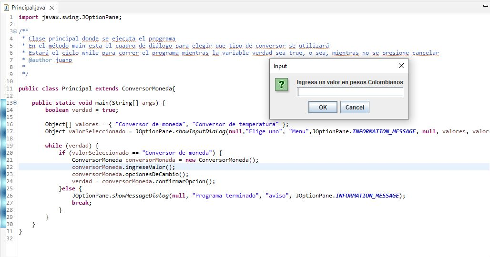
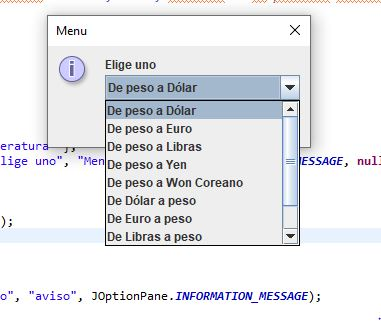
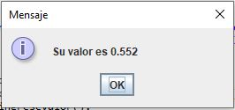
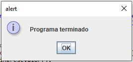

# Currency Converter - Challenge #2 of the Oracle Next Education program.

## Table of contents

- [Overview](#overview)
  - [The challenge](#the-challenge)
  - [Screenshot](#screenshot)
- [My process](#my-process)
  - [Built with](#built-with)
  - [What I learned](#what-i-learned)
- [Author](#author)

## Overview

### The challenge

The project involves building a currency converter that can perform the conversion between Colombian Pesos to US Dollars, Euros, British Pounds, Japanese Yen, and South Korean Won, as well as the reverse conversion.

- There should be a dropdown list with the possible exchange rates.
- The user should be informed when the program finishes.
- In case an incorrect value is entered, the user should be informed to input a valid value.

### Screenshot

## My process

### Built with

- Java 17
- Java Swing - Java Library

### What I learned

Aprendí un poco de la libreria de Java Swing y como realizar projectos con buenas practicas de OOP.

## Author

- LinkedIn - [Juan Pablo Cuartas](https://www.your-site.com)
- Email - [juanpa88842@gmail.com](https://www.linkedin.com/in/juanpablocuartas/)

